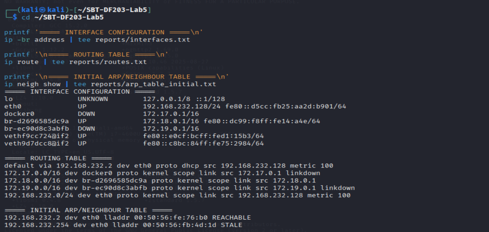
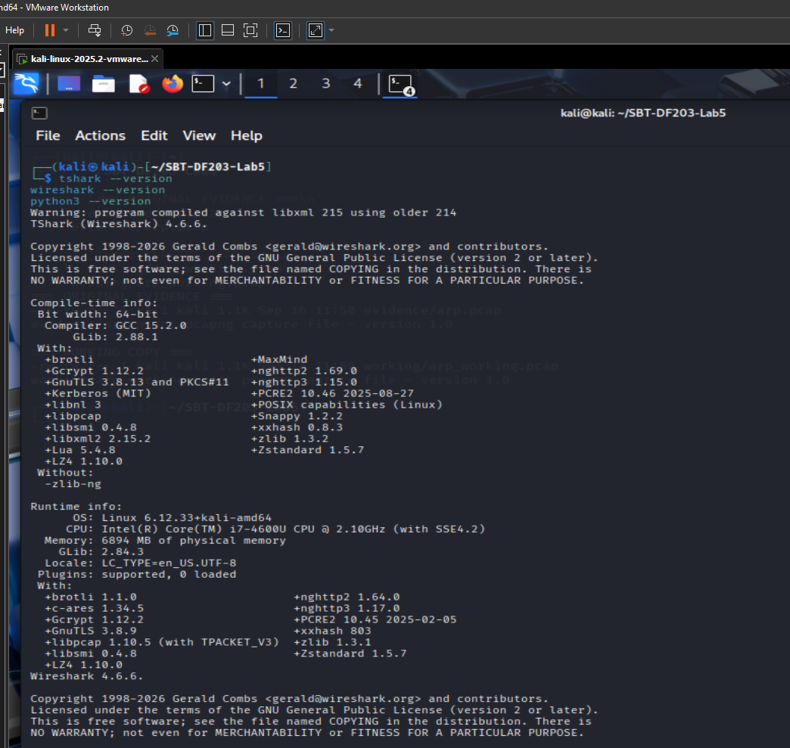
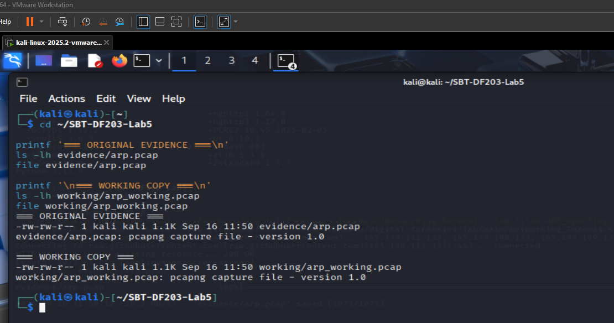
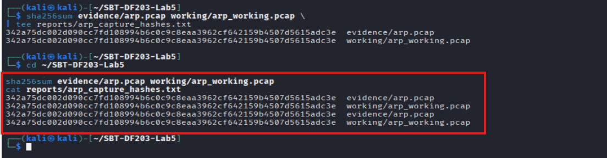

# 🔎 ARP Poisoning Forensics

A practical digital-forensics investigation of Address Resolution Protocol (ARP) traffic, conducted within an isolated virtual laboratory environment using Kali Linux, TShark, and supporting Linux networking utilities.

The project examines normal ARP behaviour, analyses a supplied ARP packet capture, identifies IP-to-MAC address relationships, reconstructs the observed ARP activity chronologically, and assesses the available evidence for indicators associated with ARP poisoning.

---

## 🛡️ Project Scope

The investigation was performed within an **authorised, isolated Host-Only Virtual Lab environment**. The analysis was limited to laboratory systems and supplied evidence.

The investigation focused on:

* 🔹 Establishing a normal ARP-resolution baseline
* 🔹 Capturing normal ARP request/reply traffic
* 🔹 Examining the local ARP neighbour cache
* 🔹 Preserving and hashing supplied packet-capture evidence
* 🔹 Identifying ARP requests and replies
* 🔹 Examining IP-to-MAC address claims
* 🔹 Identifying potentially conflicting address associations
* 🔹 Distinguishing gratuitous ARP from ordinary ARP traffic
* 🔹 Reconstructing the ARP event timeline
* 🔹 Correlating ARP requests with their corresponding replies
* 🔹 Comparing observed evidence against the normal baseline
* 🔹 Verifying the final state of the analysis workstation
* 🔹 Maintaining evidence integrity throughout the examination

---

## 📚 Complete Step-by-Step Documentation

The complete practical exercise, including the step-by-step process, commands, evidence, screenshots, analysis, and findings, is available in the accompanying PDF:

📄 **[ARP Poisoning Forensics — Complete Practical Report](./ARP%20Poisoning%20Forensics.pdf)**

The PDF provides the detailed walkthrough of the investigation from laboratory preparation through final verification.

---

## 🎯 Investigation Objectives

The investigation was designed to determine what could be established from the available ARP evidence.

The primary objectives were to:

* 🔍 Establish the expected IP-to-MAC relationship for the laboratory gateway
* 🔍 Capture and examine normal ARP traffic
* 🔍 Preserve the supplied ARP packet capture
* 🔍 Generate a cryptographic SHA-256 hash for the evidence
* 🔍 Inventory all ARP packets contained in the supplied capture
* 🔍 Identify the source IP and MAC address combinations observed
* 🔍 Examine target IP and MAC address fields
* 🔍 Identify ARP replies and correlate them with requests
* 🔍 Identify gratuitous ARP activity
* 🔍 Examine available ARP anomaly indicators
* 🔍 Construct a chronological timeline of ARP events
* 🔍 Determine whether the supplied evidence demonstrates conflicting IP-to-MAC claims
* 🔍 Verify that the analysis workstation retained its expected network configuration

---

## 🧪 Laboratory Environment

The analysis was conducted using:

| Component             | Description                    |
| --------------------- | ------------------------------ |
| 🐧 Operating System   | Kali Linux                     |
| 🌐 Network Interface  | `eth0`                         |
| 💻 Host IP            | `192.168.232.128/24`           |
| 🚪 Laboratory Gateway | `192.168.232.2`                |
| 🔗 Gateway MAC        | `00:50:56:fe:76:b0`            |
| 🧰 Packet Analysis    | TShark                         |
| 📦 Capture Format     | PCAP / PCAPNG                  |
| 🔐 Hashing            | SHA-256                        |
| 🖥️ Network Analysis  | Linux `ip` utility             |
| 🧾 Metadata Analysis  | `capinfos`                     |
| 🧪 Environment        | Isolated Host-Only Virtual Lab |

The laboratory gateway observed during the live baseline was:

```text
192.168.232.2 → 00:50:56:fe:76:b0
```

This mapping was used as part of the normal ARP baseline for the Kali workstation.

---

## 🧰 Tools Used

### 🐧 Kali Linux

Used as the primary forensic analysis environment.

### 🦈 TShark

Used for:

* ARP packet filtering
* Protocol-field extraction
* Request/reply identification
* IP-to-MAC claim analysis
* Timeline reconstruction
* Gratuitous ARP identification
* Detailed packet inspection

### 🌐 Linux `ip` Utility

Used to examine:

* Network interfaces
* IP addresses
* Routing tables
* ARP neighbour-cache entries
* Interface link state

### 🔐 SHA-256

Used to establish and subsequently verify the integrity of the supplied packet capture.

### 📊 Capinfos

Used to examine packet-capture metadata including:

* Packet count
* Capture duration
* File size
* Encapsulation
* Capture timestamps
* Hash values
* Capture application
* Operating-system information

### 🧮 AWK and Sort

Used for structured processing and identification of unique IP-to-MAC relationships.

---

# 📸 Investigation Screenshots

The repository contains screenshots documenting the major stages of the practical investigation.

All screenshots are stored in the [`Screenshots/`](./Screenshots/) directory.

---

## 🧑‍💻 Laboratory Preparation

### 🖥️ Laboratory Environment and Workspace

The initial workspace and laboratory environment were prepared within the isolated Kali Linux environment.


### 🖥️ Initial Network Environment

The initial network configuration was examined before beginning the ARP investigation.


### 🔧 Initial Network Baseline

The interface, routing information, and ARP neighbour state were recorded as the initial baseline.



---

## 🧰 Tool Verification

The forensic analysis tools were verified before evidence examination.




---

## 📦 Evidence Acquisition and Preservation

### 📥 Acquisition of Supplied ARP Capture

The supplied ARP packet capture was acquired and preserved as forensic evidence.


### 📥 Evidence Acquisition

The evidence acquisition process was documented before analysis.




### 🔐 Evidence Hash

A SHA-256 hash was generated to establish an integrity reference for the supplied capture.




### 📊 Supplied Capture Metadata

Capture metadata was examined using `capinfos`.


---

## 📡 Normal ARP Baseline

A live ARP baseline was established on the Kali workstation before examining the supplied capture.

### 🔄 Normal ARP Resolution

The normal ARP request/reply exchange demonstrated the expected gateway resolution.


### 🔄 Normal ARP Request and Reply

The individual ARP request and corresponding reply were examined.


### 📡 ARP Requests

Normal ARP request traffic was captured and examined.


### 📡 ARP Replies

Normal ARP reply traffic was examined.


---

## 🔎 Supplied ARP Packet Analysis

### 📋 ARP Packet Inventory

All ARP packets in the supplied capture were inventoried.


### 📋 ARP Reply Inventory

The ARP replies were separately extracted for examination.


### 🔬 Detailed ARP Field Examination

The detailed protocol fields of the ARP packets were examined using TShark.


### 🔬 ARP Anomaly Field Examination

Available ARP anomaly-related fields were examined, including gratuitous-ARP and duplicate-address indicators.


---

## 🔗 IP-to-MAC Analysis

### 🧩 IP-to-MAC Claim Summary

The unique source IP-to-MAC relationships observed in the supplied capture were extracted and examined.


### 🎯 Target IP and MAC Analysis

Target IP and MAC address fields were examined to distinguish unresolved targets, broadcast targets, and known MAC addresses.


---

## 🟢 Gratuitous ARP Examination

Two packets in the supplied capture were identified as gratuitous ARP.

### 🟢 Gratuitous ARP — Frame 1


### 🟢 Gratuitous ARP — Frame 7


The presence of gratuitous ARP was documented as an observable characteristic of the capture. Gratuitous ARP alone was not treated as proof of malicious activity.

---

## 🔄 ARP Request and Reply Correlation

### 🔗 Request-to-Reply Correlation

ARP requests and replies were correlated to determine whether the observed exchanges were internally consistent.


### 🔄 Reciprocal ARP Exchange

The reciprocal ARP communication between `136.160.215.15` and `136.160.215.194` was examined.


### 🔄 Normal ARP Resolution Within the Supplied Capture

The normal request/reply relationship within the supplied evidence was documented.


### 🔄 Reciprocal Exchange Within the Supplied Capture


### 🔄 ARP Request/Reply Exchange


---

## 🕒 ARP Event Timeline

The ARP traffic was reconstructed chronologically using packet timestamps and relative capture times.


The timeline showed:

```text
🟢 Gratuitous ARP
        ↓
🔵 ARP Request
        ↓
🔵 ARP Request
        ↓
🟢 ARP Reply
        ↓
🔵 ARP Request
        ↓
🟢 ARP Reply
        ↓
🟢 Gratuitous ARP
        ↓
🔵 ARP Request
```

---

## 🔐 Evidence Integrity Verification

The evidence hash was recalculated after the analysis.


The original and final SHA-256 values were identical:

```text
342a75dc002d090cc7fd108994b6c0c9c8eaa3962cf642159b4507d5615adc3e
```

This confirms that the supplied `arp.pcap` file remained unchanged during the examination.

---

## 🧹 Final System-State Verification

The Kali workstation was checked after the investigation to confirm that the expected network configuration remained operational.

### 🌐 Final ARP Neighbour Cache


The expected gateway mapping remained:

```text
192.168.232.2 → 00:50:56:fe:76:b0
```

### 🛣️ Final Routing Table


The expected default route remained configured through:

```text
192.168.232.2
```

### 💻 Final Interface State


The `eth0` interface remained operational with:

```text
192.168.232.128/24
```

### 🔗 Final Link State


The interface remained in an operational `UP` state.

### 🔍 Additional Checks

Additional verification checks were also performed as part of the final analysis.


---

# 📦 Evidence Repository Structure

```text
ARP-Poisoning-Forensics/
│
├── 📂 Screenshots/
│   ├── 01_lab_workspace.png
│   ├── 02_tool_verification.png
│   ├── 03_evidence_acquisition.png
│   ├── 04_evidence_hash.png
│   ├── 05_initial_network_baseline.png
│   ├── ARP Anomaly Field Examination.png
│   ├── ARP Event Timeline.png
│   ├── ARP Packet Inventory.png
│   ├── ARP Replies.png
│   ├── ARP Reply Inventory.png
│   ├── ARP Request_Reply Exchange.png
│   ├── ARP Requests.png
│   ├── Acquisition of Supplied ARP Capture.png
│   ├── Detailed ARP Field Examination.png
│   ├── Evidence Acquisition and Preservation.png
│   ├── Evidence Integrity SHA256 Hash.png
│   ├── Evidence Integrity Verification.png
│   ├── Final ARP Neighbor Cache Verification.png
│   ├── Final Interface State Verification.png
│   ├── Final Link State Verification.png
│   ├── Final Routing Table Verification.png
│   ├── Gratuitous ARP Frame 1.png
│   ├── Gratuitous ARP Frame 7.png
│   ├── IP_to_MAC Claim Summary.png
│   ├── Initial Network Environment.png
│   ├── Laboratory Environment and Workspace Preparation.png
│   ├── Normal ARP Request and Reply.png
│   ├── Normal ARP Resolution Within the Supplied Capture.png
│   ├── Normal ARP Resolution Within the Supplied Capture Reciprocal exchange.png
│   ├── Normal ARP Resolution.png
│   ├── Reciprocal ARP Exchange.png
│   ├── Request_to_Reply Correlation.png
│   ├── Supplied Capture Metadata.png
│   ├── Target IP and MAC Analysis.png
│   ├── Verification of Forensic Analysis Tools.png
│   ├── Verification of Forensic Analysis Tools2.png
│   └── additonal checks.png
│
├── 📂 evidence/
│   ├── arp.pcap
│   └── normal_arp.pcapng
│
├── 📂 reports/
│   ├── arp_anomaly_fields.txt
│   ├── arp_capture_hashes.txt
│   ├── arp_detailed_analysis.txt
│   ├── arp_pcap_capinfos.txt
│   ├── arp_pcap_final_sha256.txt
│   ├── arp_pcap_sha256.txt
│   ├── arp_replies_only.txt
│   ├── arp_reply_inventory.txt
│   ├── arp_request_reply_correlation.txt
│   ├── arp_table_after_ping.txt
│   ├── arp_table_final.txt
│   ├── arp_table_initial.txt
│   ├── arp_timeline.txt
│   ├── final_interface_state.txt
│   ├── final_link_state.txt
│   ├── final_route_table.txt
│   ├── interfaces.txt
│   ├── routes.txt
│   ├── target_ip_mac_pairs.txt
│   └── unique_ip_mac_claims.txt
│
├── 📂 working/
│   └── arp_working.pcap
│
├── 📄 ARP Poisoning Forensics.pdf
└── 📄 README.md
```

---

# 📦 Evidence Summary

The primary supplied capture contained:

```text
📦 8 total ARP packets
📡 6 ARP requests
📡 2 ARP replies
🟢 2 gratuitous ARP requests
🔗 3 unique source IP-to-MAC mappings
⚠️ 0 observed conflicting source IP-to-MAC mappings
⚠️ No populated duplicate-address indicator
```

---

# 🔍 Key Forensic Findings

| 🔎 Finding                             | 📋 Observation                      |
| -------------------------------------- | ----------------------------------- |
| 📦 Evidence size                       | 8 ARP packets                       |
| 📡 ARP requests                        | 6                                   |
| 📡 ARP replies                         | 2                                   |
| 🟢 Gratuitous ARP                      | 2 packets                           |
| 🔗 Unique source IP-to-MAC mappings    | 3                                   |
| ⚠️ Conflicting source IP-to-MAC claims | None observed                       |
| ⚠️ Duplicate-address indicator         | None populated                      |
| 🔄 Reciprocal request/reply exchanges  | 2                                   |
| 🔐 Evidence hash                       | SHA-256 verified                    |
| 🌐 Final gateway mapping               | `192.168.232.2 → 00:50:56:fe:76:b0` |
| 💻 Final interface state               | `eth0 UP`                           |
| 🛣️ Final default route                | Via `192.168.232.2`                 |

---

# 🧠 Forensic Assessment

The supplied capture was assessed specifically for evidence of conflicting IP-to-MAC claims.

The following mappings were observed consistently:

```text
136.160.215.1
    ↓
00:1b:17:00:0a:30

136.160.215.15
    ↓
00:50:56:86:cb:fc

136.160.215.194
    ↓
00:50:56:86:02:65
```

No IP address in the eight-packet capture was observed being associated with multiple MAC addresses.

The capture therefore does **not provide sufficient packet-level evidence to establish a conflicting IP-to-MAC advertisement**.

The presence of gratuitous ARP traffic was noted, but it was not treated as conclusive evidence of ARP poisoning because gratuitous ARP can occur for legitimate networking purposes.

---

---

## 📦 Evidence Collection

### 🌐 Normal ARP Baseline

A normal ARP exchange was captured from the Kali workstation before examining the supplied evidence.

The capture demonstrated the following sequence:

```text
Kali
192.168.232.128
MAC: 00:0c:29:77:75:3c
        │
        │ ARP Request
        │ "Who has 192.168.232.2?"
        ▼
Gateway
192.168.232.2
MAC: 00:50:56:fe:76:b0
        │
        │ ARP Reply
        ▼
Kali
```

The normal capture contained:

```text
ARP Request
192.168.232.128 → 192.168.232.2

ARP Reply
192.168.232.2 → 192.168.232.128
```

The resulting neighbour-cache entry was:

```text
192.168.232.2 lladdr 00:50:56:fe:76:b0 REACHABLE
```

This established the expected gateway mapping for the live laboratory environment.

---

## 📦 Supplied ARP Evidence

The supplied evidence file is:

```text
evidence/arp.pcap
```

The capture contains:

```text
📦 8 packets
📡 6 ARP requests
📡 2 ARP replies
⏱️ Approximately 63.13 seconds of capture time
```

The capture is an Ethernet ARP capture stored in PCAPNG format.

---

## 🔐 Evidence Integrity

The SHA-256 hash calculated for the supplied capture was:

```text
342a75dc002d090cc7fd108994b6c0c9c8eaa3962cf642159b4507d5615adc3e
```

The hash was recorded before analysis and recalculated after the examination.

The final hash remained identical:

```text
342a75dc002d090cc7fd108994b6c0c9c8eaa3962cf642159b4507d5615adc3e
```

This confirms that the supplied evidence file remained unchanged during the analysis.

---

## 🧾 ARP Packet Inventory

The supplied capture contained eight ARP packets.

| Frame | Type                 | Source IP         | Source MAC          | Target IP         | Target MAC          |
| ----- | -------------------- | ----------------- | ------------------- | ----------------- | ------------------- |
| 🟢 1  | Request / Gratuitous | `136.160.215.1`   | `00:1b:17:00:0a:30` | `136.160.215.1`   | Broadcast           |
| 🔵 2  | Request              | `136.160.215.1`   | `00:1b:17:00:0a:30` | `136.160.215.199` | Broadcast           |
| 🔵 3  | Request              | `136.160.215.15`  | `00:50:56:86:cb:fc` | `136.160.215.194` | Unknown             |
| 🟢 4  | Reply                | `136.160.215.194` | `00:50:56:86:02:65` | `136.160.215.15`  | `00:50:56:86:cb:fc` |
| 🔵 5  | Request              | `136.160.215.194` | `00:50:56:86:02:65` | `136.160.215.15`  | Unknown             |
| 🟢 6  | Reply                | `136.160.215.15`  | `00:50:56:86:cb:fc` | `136.160.215.194` | `00:50:56:86:02:65` |
| 🟢 7  | Request / Gratuitous | `136.160.215.1`   | `00:1b:17:00:0a:30` | `136.160.215.1`   | Broadcast           |
| 🔵 8  | Request              | `136.160.215.1`   | `00:1b:17:00:0a:30` | `136.160.215.183` | Broadcast           |

---

## 🧩 IP-to-MAC Address Claims

The unique source IP-to-MAC relationships identified in the capture were:

```text
136.160.215.1   → 00:1b:17:00:0a:30
136.160.215.15  → 00:50:56:86:cb:fc
136.160.215.194 → 00:50:56:86:02:65
```

Each observed source IP was associated with a single MAC address throughout the supplied capture.

No source IP was observed being advertised by two different MAC addresses.

This is an important finding because a conflicting IP-to-MAC association would be one of the packet-level indicators that could support an ARP-poisoning assessment.

---

## ⚠️ Gratuitous ARP Analysis

Frames **1** and **7** were identified as gratuitous ARP requests.

Both packets contained:

```text
Source IP:       136.160.215.1
Source MAC:      00:1b:17:00:0a:30
Target IP:       136.160.215.1
Target MAC:      ff:ff:ff:ff:ff:ff
```

The packets were therefore classified as gratuitous ARP.

However, gratuitous ARP traffic by itself does **not** establish malicious activity.

A valid system may generate gratuitous ARP for legitimate networking purposes, such as announcing or refreshing an address-to-MAC association.

Consequently, the gratuitous ARP packets were documented as observable behaviour but were not independently classified as evidence of poisoning.

---

## 🔄 ARP Request and Reply Correlation

Two complete ARP request/reply exchanges were identified.

### 🔹 Exchange A

```text
Frame 3
136.160.215.15
00:50:56:86:cb:fc
        │
        │ ARP Request
        ▼
136.160.215.194
        │
        │ ARP Reply
        ▼
Frame 4
00:50:56:86:02:65
```

The reply followed the request by approximately:

```text
542 microseconds
```

### 🔹 Exchange B

```text
Frame 5
136.160.215.194
00:50:56:86:02:65
        │
        │ ARP Request
        ▼
136.160.215.15
        │
        │ ARP Reply
        ▼
Frame 6
00:50:56:86:cb:fc
```

The reply followed the request by approximately:

```text
21 microseconds
```

Both exchanges were internally consistent with the observed source and destination IP-to-MAC relationships.

---

## 🕒 ARP Event Timeline

The capture began at approximately:

```text
2023-03-11 22:22:03
```

The observed sequence was:

```text
🟢 00.000000
Gratuitous ARP from 136.160.215.1

🔵 35.132502
ARP request from 136.160.215.1 for 136.160.215.199

🔵 41.844068
ARP request from 136.160.215.15 for 136.160.215.194

🟢 41.844610
ARP reply from 136.160.215.194

🔵 46.883510
ARP request from 136.160.215.194 for 136.160.215.15

🟢 46.883530
ARP reply from 136.160.215.15

🟢 59.999749
Gratuitous ARP from 136.160.215.1

🔵 63.132452
ARP request from 136.160.215.1 for 136.160.215.183
```

No point in the sequence shows a source IP changing its advertised MAC address.

---

## 🧪 ARP Anomaly Field Examination

The available ARP protocol fields were examined for:

```text
arp.isgratuitous
arp.duplicate-address-detected
```

The analysis confirmed:

* 🟢 Frames 1 and 7 were marked as gratuitous ARP.
* ⚪ No populated duplicate-address-detected indicator was observed.
* 🟢 The observed source IP-to-MAC mappings remained consistent.
* 🟢 No conflicting sender claim was identified.

The absence of a populated duplicate-address field does not independently prove that an ARP attack did not occur. It is simply one additional observation from the supplied packet evidence.

---

## 🔍 Forensic Assessment

The supplied capture was assessed specifically for evidence of conflicting IP-to-MAC claims.

The following mappings were observed consistently:

```text
136.160.215.1
    ↓
00:1b:17:00:0a:30

136.160.215.15
    ↓
00:50:56:86:cb:fc

136.160.215.194
    ↓
00:50:56:86:02:65
```

No IP address in the eight-packet capture was observed being associated with multiple MAC addresses.

The capture therefore does **not provide sufficient packet-level evidence to establish a conflicting IP-to-MAC advertisement**.

The presence of gratuitous ARP traffic was noted, but it was not treated as conclusive evidence of ARP poisoning because gratuitous ARP can occur for legitimate networking purposes.

---

## 🚪 Gateway Evidence and Scope Limitation

The live Kali baseline established:

```text
192.168.232.2
    ↓
00:50:56:fe:76:b0
```

However, the supplied historical capture uses a different network:

```text
136.160.215.0/24
```

The supplied capture therefore should not be treated as if it were a capture from the same network as the live Kali workstation.

In particular, the IP address:

```text
136.160.215.1
```

was not automatically classified as the laboratory gateway because the supplied evidence does not establish that relationship.

This distinction prevents the analysis from incorrectly applying the live laboratory network configuration to a separate historical packet capture.

---

## 🧹 Final System-State Verification

Following the examination, the Kali workstation was checked to confirm that its network configuration remained operational.

### 🌐 Final ARP Neighbour Cache

```text
192.168.232.254 lladdr 00:50:56:fb:4d:1d STALE
192.168.232.2   lladdr 00:50:56:fe:76:b0 REACHABLE
```

The expected gateway mapping remained:

```text
192.168.232.2 → 00:50:56:fe:76:b0
```

### 🛣️ Final Routing Configuration

```text
default via 192.168.232.2 dev eth0
src 192.168.232.128
```

The expected default route through the laboratory gateway remained present.

### 💻 Final Interface State

```text
eth0 UP
192.168.232.128/24
```

### 🔗 Final Link State

```text
eth0: <BROADCAST,MULTICAST,UP,LOWER_UP>
```

The interface remained operational following the investigation.

---

## 📊 Key Findings

| 🔎 Finding                             | 📋 Observation                      |
| -------------------------------------- | ----------------------------------- |
| 📦 Evidence size                       | 8 ARP packets                       |
| 📡 ARP requests                        | 6                                   |
| 📡 ARP replies                         | 2                                   |
| 🟢 Gratuitous ARP                      | 2 packets                           |
| 🔗 Unique source IP-to-MAC mappings    | 3                                   |
| ⚠️ Conflicting source IP-to-MAC claims | None observed                       |
| ⚠️ Duplicate-address indicator         | None populated                      |
| 🔄 Reciprocal request/reply exchanges  | 2                                   |
| 🔐 Evidence hash                       | SHA-256 verified                    |
| 🌐 Final gateway mapping               | `192.168.232.2 → 00:50:56:fe:76:b0` |
| 💻 Final interface state               | `eth0 UP`                           |
| 🛣️ Final default route                | Via `192.168.232.2`                 |

---

# 🚪 Gateway Evidence and Scope Limitation

The live Kali baseline established:

```text
192.168.232.2
    ↓
00:50:56:fe:76:b0
```

However, the supplied historical capture uses a different network:

```text
136.160.215.0/24
```

The supplied capture therefore should not be treated as if it were a capture from the same network as the live Kali workstation.

In particular, the IP address:

```text
136.160.215.1
```

was not automatically classified as the laboratory gateway because the supplied evidence does not establish that relationship.

This distinction prevents the analysis from incorrectly applying the live laboratory network configuration to a separate historical packet capture.

---

# 🔐 Evidence Integrity

The SHA-256 hash calculated for the supplied capture was:

```text
342a75dc002d090cc7fd108994b6c0c9c8eaa3962cf642159b4507d5615adc3e
```

The same SHA-256 value was obtained during the final integrity check.

This provides an integrity reference for:

```text
evidence/arp.pcap
```

---

# 🧹 Final System-State Verification

Following the examination, the Kali workstation was checked to confirm that its network configuration remained operational.

### 🌐 ARP Neighbour Cache

```text
192.168.232.254 lladdr 00:50:56:fb:4d:1d STALE
192.168.232.2   lladdr 00:50:56:fe:76:b0 REACHABLE
```

### 🛣️ Routing

```text
default via 192.168.232.2 dev eth0
```

### 💻 Interface

```text
eth0 UP
192.168.232.128/24
```

### 🔗 Link

```text
eth0: <BROADCAST,MULTICAST,UP,LOWER_UP>
```

The expected gateway mapping, route, interface configuration, and link state remained intact following the investigation.

---

# 🧾 Conclusion

The forensic examination established a normal ARP-resolution baseline on the Kali workstation and subsequently analysed the supplied ARP packet capture.

The supplied capture contained eight ARP packets consisting of six requests and two replies. Two packets were identified as gratuitous ARP requests, while two pairs represented reciprocal ARP request/reply exchanges.

The source IP-to-MAC analysis identified three unique address associations, and no source IP was observed being advertised by multiple MAC addresses. The available ARP anomaly fields also did not identify a populated duplicate-address indicator.

The evidence file was preserved using SHA-256 hashing. The initial and final SHA-256 values were identical, confirming that the supplied packet capture was not modified during the examination.

The final Kali workstation checks confirmed that the expected gateway mapping, default route, interface address, and link state remained intact.

Based on the **eight packets available in the supplied capture**, the investigation did not identify sufficient packet-level evidence to establish a conflicting IP-to-MAC claim. The observed gratuitous ARP activity was documented as an observable characteristic of the capture but was not treated as proof of malicious ARP poisoning in isolation.

The conclusion is therefore limited to the evidence available in the supplied capture and does not make a broader determination about activity outside the captured evidence.

---

# ⚖️ Evidence Handling Note

All packet captures and analysis outputs in this repository were generated or examined as part of an authorised practical laboratory exercise.

The evidence should be interpreted within the context of the supplied laboratory scenario.

No production, public, or third-party systems were intentionally targeted during the investigation.

---

# 🧑‍💻 Author

**K. Omolara Animashawun, CISSP**

Cybersecurity Professional

Digital Forensics & Incident Response | Application Security | GRC | Threat Intelligence

---

# 📌 Disclaimer

This repository is intended for educational and professional-development purposes within an authorised cybersecurity laboratory context.

The analysis represents findings derived from the specific evidence available for this practical exercise. Absence of an observed indicator in a limited packet capture should not be interpreted as proof that the corresponding activity could never have occurred outside the captured evidence.
